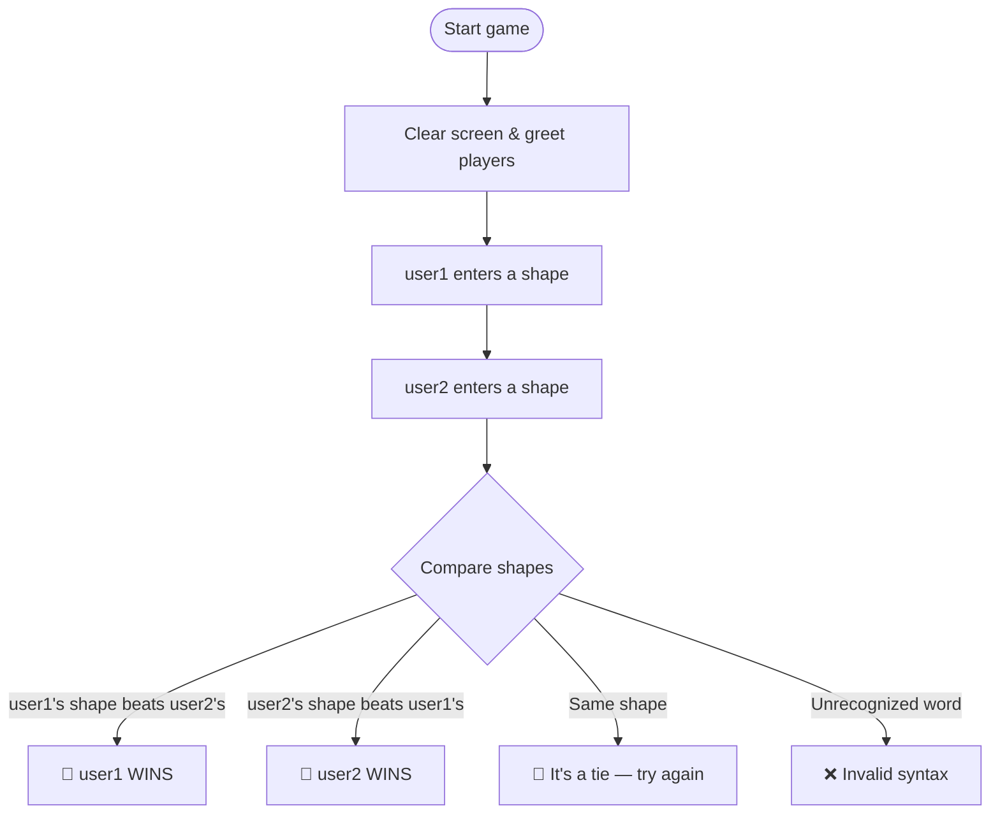

<div align="center">
Let's Play - Stone Paper Scissors

<br/>


### 🪨 vs 📄 vs ✂️ — the oldest duel in the book, now in Python

*Two players. One keyboard. Zero mercy.*

</div>


## ✨ Features

| | |
|---|---|
| 🤝 | **Local 2‑player** — pass the keyboard, no accounts, no internet |
| ⚡ | **Instant verdict** — one input each, result printed immediately |
| 🔡 | **Case-insensitive input** — `Stone`, `STONE`, and `stone` all work |
| 🧠 | **Classic rules** — stone beats scissor, scissor beats paper, paper beats stone |
| 🪶 | **Tiny footprint** — a single file, pure Python, zero dependencies |

---

## 🕹️ How It Works



### 🏆 Rules at a Glance

| user1 plays | beats | user2 plays |
|:---:|:---:|:---:|
| 🪨 stone | crushes | ✂️ scissor |
| 📄 paper | covers | 🪨 stone |
| ✂️ scissor | cuts | 📄 paper |

Same shape on both sides → **tie**. Anything else → **invalid input**.

---

## 🚀 Getting Started

### Prerequisites
- Python 3 installed on your machine

### Run it

```bash
git clone <your-repo-url>
cd <your-repo-folder>
python3 rps.py
```

### Sample Session

```text
HELLO GUYZ! SHAKE YOUR HANDS. AFTER SHAKING, Enter data:)
user1 ENTER YOUR SHAPE: stone
user2 ENTER YOUR SHAPE: scissor
CONGRATS user1 WINS! 
```

*(Verified by actually running the script through every combination of stone / paper / scissor, plus a tie and an invalid word — all eight cases returned the correct message.)*

---

## ✅ Verification Notes

Being upfront about what was checked, since a README should never overpromise:

- **All 6 win conditions** produce the correct winner.
- **All 3 tie conditions** (`stone`/`stone`, `paper`/`paper`, `scissor`/`scissor`) correctly print "BOTH SHAPES ARE SAME!" with no crash.
- **Unrecognized input** (e.g. `rock`) correctly falls through to "INVALID SYNTAX!".
- **Heads-up:** `os.system("cls")` only clears the screen on Windows. On macOS/Linux it's a no-op (the `cls` command doesn't exist there), so the screen simply won't clear — harmless, but worth knowing if you're on Mac/Linux and wondering why old output lingers. Swap in `os.system("cls" if os.name == "nt" else "clear")` if you want it cross-platform.

---

## 🗂️ Project Structure

```
.
├── rps.py            # the game
├── README.md
└── assets/
    ├── banner.svg
    └── terminal-demo.svg
```

---

## 🤝 Contributing

Got an idea — best-of-3 rounds, a computer opponent, colored terminal output? PRs and issues are welcome.

## 📜 License

This project is licensed under the [MIT License](./LICENSE) — free to use, copy, modify, and share.

<div align="center">

<br/>

**🪨 📄 ✂️  May the best shape win.**

</div>
 Author:  Hadiqa Hanif :)
